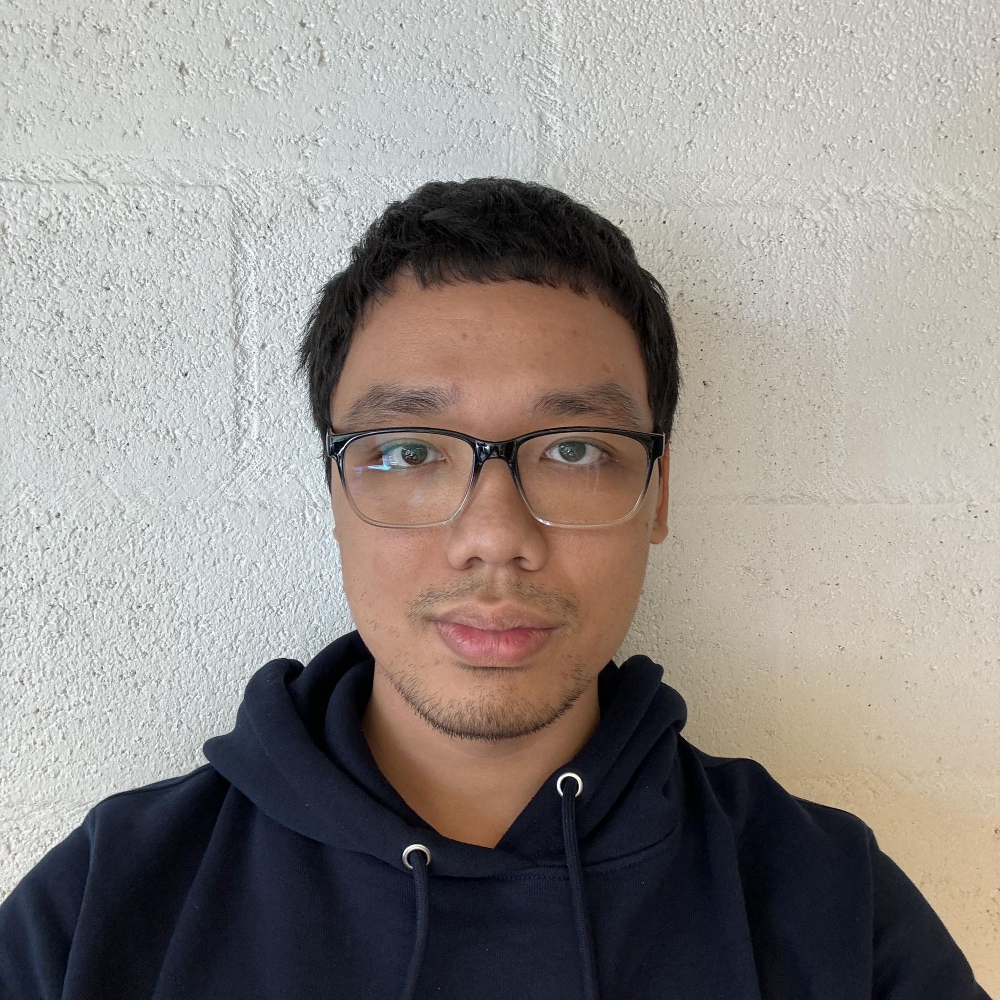

# About me 
Hi, I'm Bách, a Linguist/Cognitive Scientist from Vietnam.

I am a PhD student at [QLVL Research Group](https://www.arts.kuleuven.be/ling/qlvl) @ KU Leuven, working as part of the MSCA funded Doctoral Network [CASCADE](https://www.horizoncascade.net/).
I developed an interest in Linguistics in the third year of my Finance undergrad. I then obtained an MSc in Linguistics from the University of Stirling (Scotland) and I am currently expanding my understanding of the field of Cognition (Philosophy, Psychology, Neuroscience, Artificial Intelligence). My linguistics research interests are Semantics, Language Change and Variation, Construction Grammar, Grammaticalisation. I am familiar with Quantitative/Statistical methods, Python Programming, and several Machine/Deep Learning models. Besides learning and researching about languages, I'm also experienced in teaching languages (English, Vietnamese) to different types of learners. 

My other interests are Physics, Physiology, Martial Arts, Vocal Science (I am a Full Lyric Tenor).

---

# Useful links

- [Curriculum Vitae](cv.md)
- [Classes](classes.md)
- [Articles (both linguistic and non-linguistic)](articles.md)

---

# Contact me

- [Email](mailto:phantatbach@gmail.com)
- [Facebook (Personal)](https://facebook.com/phantatbach)
- [Facebook (Page)](https://www.facebook.com/bachclasses)
- [Github](https://github.com/phantatbach)
- [Google Scholar](https://scholar.google.com/citations?user=wqWxx7wAAAAJ&hl=en)
- [LinkedIn](https://linkedin.com/in/phantatbach)
- [ORCID](https://orcid.org/0000-0002-8216-4978)
- [X](https://x.com/phantatbach)
- [YouTube (for singing only)](https://youtube.com/@phantatbach)

